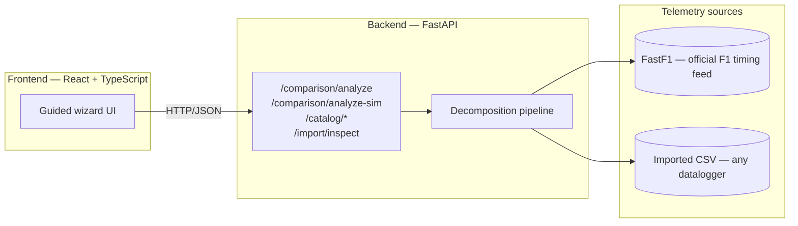
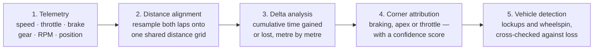

# Lap Performance Analyzer

**Distance-domain telemetry decomposition and causal lap analysis.**

Compare two laps and find out exactly **where** time was gained or lost, **why**
it happened, and whether the **driver** or the **car** caused it — for Formula 1
sessions or your own imported telemetry.

---

## Highlights

- Supports Formula 1 telemetry through FastF1
- Supports imported telemetry CSVs
- Distance-domain telemetry alignment
- Corner-level causal attribution
- Vehicle-state detection (lockup / wheelspin)
- Interactive telemetry visualisation
- One-click engineering report export

---

## Table of contents

- [Highlights](#highlights)
- [What it does](#what-it-does)
- [Architecture](#architecture)
- [Key features](#key-features)
- [Tech stack](#tech-stack)
- [Project structure](#project-structure)
- [Getting started](#getting-started)
- [How the pipeline works](#how-the-pipeline-works)
- [Importing your own telemetry](#importing-your-own-telemetry)
- [Validation & credibility](#validation--credibility)
- [Testing](#testing)
- [Deployment](#deployment)
- [Assumptions & limitations](#assumptions--limitations)
- [License](#license)

---

## What it does

Race engineers never study a driver in isolation — braking early could be
technique, or it could be the car losing grip. This tool takes two laps of
telemetry, aligns them by **distance** rather than time (the only way to make
two laps of different durations actually comparable), and produces a
corner-by-corner account of the gap between them: which corner cost the most
time, what driver input explains it, and whether the car's own behaviour
(a lockup, wheelspin) was a contributing factor.

A companion import path accepts telemetry from any datalogger — Formula
Student, sim racing, or a custom CSV export — and runs it through the
identical decomposition, so the analysis isn't tied to one data source.

## Architecture



The frontend never talks to FastF1 or a CSV directly — everything flows
through one FastAPI surface, so the UI is identical regardless of where the
telemetry came from.

## Key features

- **Distance-domain alignment** — two laps of different duration resampled
  onto one shared distance grid, so every index means the same point on track.
- **Per-corner causal attribution** — each corner's time loss is traced to a
  specific driver input (late/early braking, lower apex speed, delayed
  throttle), with a **confidence score** that's low when signals conflict
  instead of forcing a guess.
- **Vehicle-state detection** — lockups and wheelspin inferred from
  Speed/RPM/gear/brake, cross-checked against local time loss so a flagged
  event is backed by two independent signals, not a self-report.
- **Reconciliation validation** — the sum of per-corner deltas is checked
  against the actual measured lap-time gap; any mismatch beyond tolerance is
  surfaced, not hidden.
- **Rule-based recommendations** — a deterministic, direction-verified
  corrective suggestion per corner (e.g. "carry more apex speed," never a
  black-box LLM guess).
- **Interactive thermal track map** — the racing line coloured by time delta,
  hover-and-click synced across the map, corner list, and telemetry traces.
- **CSV import for any telemetry source** — alias-matched column mapping, a
  data-quality gate (track closure, physical plausibility, braking/acceleration
  zones), and an Upload → Inspect → Validate → Run flow before anything is analysed.
- **Export** — a full JSON dump of the analysis, or a print-ready PDF report.

## Tech stack

| Layer | Technology |
|---|---|
| Backend | FastAPI, Python 3.11, FastF1, NumPy, SciPy, pandas |
| Backend testing | pytest |
| Frontend | React 18, TypeScript, Vite |
| Frontend charts | D3 (d3-scale, d3-shape) |
| Frontend fonts | Inter Variable, IBM Plex Mono (self-hosted) |
| Deployment | Railway (backend), Vercel (frontend) |

## Project structure

```
backend/
├── app/
│   ├── ingestion/        # FastF1 loader, CSV importer, corner reference
│   ├── processing/       # resampling, delta calc, cause classifier,
│   │                     #   vehicle-state flags, data-quality gate
│   ├── api/               # FastAPI routers (comparison, catalog, import)
│   ├── schemas/           # internal + API (Pydantic) data contracts
│   └── pipeline.py        # orchestrates ingestion → processing → response
├── tests/                # pytest suite (one file per pipeline stage)
├── scripts/               # demo scripts + sample-data generator
└── data/                  # FastF1 disk cache, sample import CSV

frontend/
├── src/
│   ├── wizard/            # app state machine (mode, step, request, results)
│   ├── pages/              # Welcome, Configure, Import, Results
│   ├── components/         # chart primitives (track map, traces, corner list)
│   └── theme/              # design tokens + component styles
└── public/                # bundled sample CSV for the quick-start demo
```

## Getting started

### Backend

```bash
cd backend
python -m venv .venv
# Windows: .venv\Scripts\Activate.ps1
# macOS/Linux: source .venv/bin/activate

pip install -r requirements.txt
uvicorn app.main:app --reload --port 8001
```

Swagger / interactive API reference is served at `http://127.0.0.1:8001/docs` —
this is the canonical API documentation; every request/response schema is
defined there directly from the FastAPI route signatures.

### Frontend

```bash
cd frontend
npm install
npm run dev
```

The Vite dev server proxies API calls to `http://127.0.0.1:8001` (see
`vite.config.ts`). For a deployed backend, set `VITE_API_URL` instead.

## How the pipeline works



| Stage | What happens | Key file |
|---|---|---|
| Telemetry | Load two laps' channels from FastF1 or an imported CSV | `ingestion/fastf1_loader.py`, `ingestion/sim_import.py` |
| Distance alignment | Resample both laps onto a common distance grid (linear for continuous channels, nearest-neighbour for discrete ones) | `processing/distance_resample.py` |
| Delta analysis | Integrate the speed difference into a cumulative time-delta trace | `processing/delta_calculator.py` |
| Corner attribution | Slice the delta trace at each corner; classify the dominant cause and its confidence | `processing/cause_classifier.py` |
| Vehicle detection | Flag lockups/wheelspin from Speed/RPM/gear/brake; cross-check against local time loss | `processing/vehicle_state_flags.py` |

## Importing your own telemetry

The import path (`POST /comparison/analyze-sim`, plus a preview-only
`POST /import/inspect`) accepts a CSV from any datalogger — Formula Student,
sim racing (Assetto Corsa, iRacing), or a custom export. Column names don't
need to match exactly: an alias table in `ingestion/sim_import.py` maps common
header variants (`speed_kph`, `velocity`, `gps_speed`, …) onto the same
internal schema FastF1 data uses, so the rest of the pipeline runs completely
unchanged regardless of source.

Before anything is analysed, the file goes through a guided **Upload → Inspect
→ Validate → Run** flow in the UI:

1. **Upload** — drag in a CSV.
2. **Inspect** — the detected laps, channels, and a track-shape preview are
   shown so you can see what was actually parsed.
3. **Validate** — a data-quality gate checks the track closes into a loop,
   the distance axis is monotonic, speed/RPM/gear values are physically
   plausible, and both braking and acceleration zones are present. Any check
   that fails is shown, not hidden — you decide whether to proceed.
4. **Run** — the identical corner-by-corner decomposition used for F1 laps.

A bundled sample session ships with the app so the import flow can be tried
immediately from the "Formula Student demo" quick-start — it's been tested
against local data throughout development.

## Validation & credibility

There's no external "what did the team actually do" ground truth to check
this analysis against, so credibility comes from internal consistency instead:

- **Reconciliation** — the sum of all per-corner time deltas must reconstruct
  the actual measured lap-time gap. The reconciliation error is computed and
  shown, not just tested internally — flagged automatically if it exceeds tolerance.
- **Analysis confidence score** — a transparent 0–100 composite of
  reconciliation tightness, per-corner attribution confidence, and
  vehicle-state cross-check agreement. The formula and its breakdown are
  always shown alongside the number — never a black-box score.
- **Physical-realism cross-check** — a flagged lockup or wheelspin is only
  credible if it coincides with actual local time loss; that agreement rate
  is computed and reported per analysis.

## Testing

```bash
cd backend
pytest -q
```

The backend has a pytest suite covering every pipeline stage — resampling
correctness (including closed-form synthetic fixtures with a known answer),
delta-integration accuracy, corner-attribution logic, vehicle-state detection,
the API contract, the catalog endpoints, and the CSV-import path.

The frontend doesn't have an automated test suite; it's been verified through
direct end-to-end use of the running application — every documented feature
was exercised in a live browser session against the real backend before being
considered done.

## Deployment

- **Backend** — Railway (Docker), running the FastAPI app behind `uvicorn`.
- **Frontend** — Vercel, with `VITE_API_URL` pointed at the deployed backend.

## Assumptions & limitations

- Comparing laps assumes the same car and driver, to isolate technique from
  car/setup differences.
- Braking-point and throttle-point detection use fixed, documented
  thresholds (see `app/config.py`) rather than a learned model.
- Threshold-based cause classification can misfire on ambiguous inputs — a
  trail-braking style and a late-braking style can look similar in raw
  threshold terms. This is exactly what the confidence score exists to flag.
- Vehicle-state detection is a derived proxy, not a direct sensor reading,
  and can false-positive on legitimate hard driving — hence the
  physical-realism cross-check.
- Per-corner attributions inherit the analysis's own global reconciliation
  error; they are not independently more precise than that figure.
- Brake temperature, tyre temperature/pressure, and suspension telemetry are
  not part of the public F1 timing feed and are never used or fabricated.

## License

MIT — see [LICENSE](./LICENSE).
